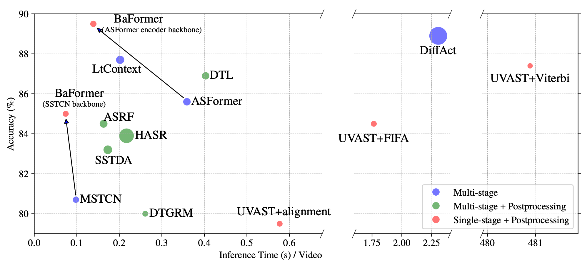
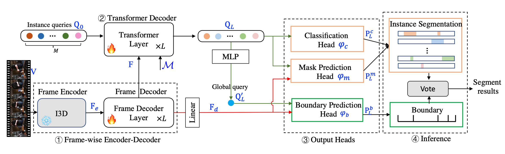

 # BaFormer
This is the official implementation for the paper: "**Efficient Temporal Action Segmentation via Boundary-aware Query Voting**".
[](https://arxiv.org/pdf/2405.15995)
[](https://proceedings.neurips.cc/paper_files/paper/2024/file/42770daf4a3384b712ea9c36e9279998-Paper-Conference.pdf)


[📄 arXiv](https://arxiv.org/pdf/2405.15995) | [🧠 NeurIPS](https://proceedings.neurips.cc/paper_files/paper/2024/file/42770daf4a3384b712ea9c36e9279998-Paper-Conference.pdf)


## 🚀 Overview
BaFormer delivers competitive results while requiring less FLOPs and running time. Moreover, our query-based voting mechanism significantly reduces inference time required by the single-stage model.

<div align="center">
  
  <p><em>Figure 1: Accuray vs. inference time on 50Salads. The bubble size represents the FLOPs in inference. Under different backbones, BaFormer enjoys the benefit of boundary-aware query voting with less running time and improved accuracy.</em></p>
</div>

<div align="center">
  
  <p><em>Figure 2: It predicts query classes and masks, along with boundaries from output heads. Although each layer in the Transformer decoder holds three heads, we illustrate the three heads in the last layer for simplicity.</em></p>
</div>


## 🛠️ Installation

```bash
# 1. Clone the repo
git clone https://github.com/peiyao-w/BaFormer.git
cd BaFormer

# 2. Create environment
conda create -n baformer python=3.8 -y
conda activate baformer

# 3. Install dependencies
pip install -r requirements.txt
```

## Dataset Preparation
(1) To obtain the features and ground-truth annotations, please download the data as described in [Data Preparation](https://github.com/yabufarha/ms-tcn), and organize it according to the following structure. Then update the data path in the code to match the location of your downloaded dataset.

```bash
data/
 ├── 50salads/
 │    ├── mapping.txt/
 │    └── splits/
 │          ├── train.split1.bundle
 │          ├── train.split2.bundle
 │          ├── train.split3.bundle
 │          ├── train.split4.bundle
 │          ├── train.split5.bundle
 │          ├── test.split1.bundle
 │          ├── test.split2.bundle
 │          ├── test.split3.bundle
 │          ├── test.split4.bundle
 │          └── test.split5.bundle
 │    └── groundTruth/
 │    └── feature/
 ├── gtea/
 └── breakfast/
```
## 🧠 Training

To train BaFormer on a selected dataset, you can specify the dataset name, split, and path using the following arguments:

```bash
python main.py --config configs/framed_en_de.yaml  dataset.name 50salads dataset.split 1 dataset.dataset_dir /path/to/your_data/
```
Here:
- `dataset.name` defines which dataset to use (e.g., `gtea`, `breakfast`, or `50salads`).
- `dataset.split` specifies the split index for training/testing.
- `dataset.dataset_dir` points to the root directory where your dataset is stored.

## 📈 Evaluation

After training the model, you can evaluate BaFormer on the test set using the following command:

```bash
python Inference.py --config configs/framed_en_de.yaml --checkpoint experiment/checkpoints/model_best.pth dataset.name 50salads dataset.split 1 dataset.dataset_dir /path/to/your_data/
```

## 📂 Checkpoints and Logs
Checkpoints and logs will be automatically saved under:

```bash
./experiments/
 ├── 50salads/
 │      └── bk_fde_tde/final/
 │           ├── 1/
 │               ├── checkpoint_best.pth
 │               ├── log_plain.txt
 │               ├── log.txt
 │               ├── last_checkpoint
 │               ├── config.yaml
 │               ├── config_min.yaml
 │               ├── env.yaml
 │               └── logs_epoch/
 │           ├── 2/
              ....

 ├── gtea/
 └── breakfast/
```
Our trained [checkpoints]() are provided below. Please place them in the `experiments/` directory before running evaluation.

## 📄 Other


## Citation
```bash
@article{wang2024efficient,
  title={Efficient temporal action segmentation via boundary-aware query voting},
  author={Wang, Peiyao and Lin, Yuewei and Blasch, Erik and Ling, Haibin and others},
  journal={Advances in Neural Information Processing Systems},
  volume={37},
  pages={37765--37790},
  year={2024}
}
```
